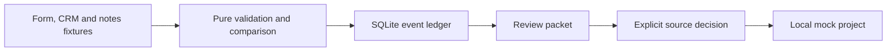
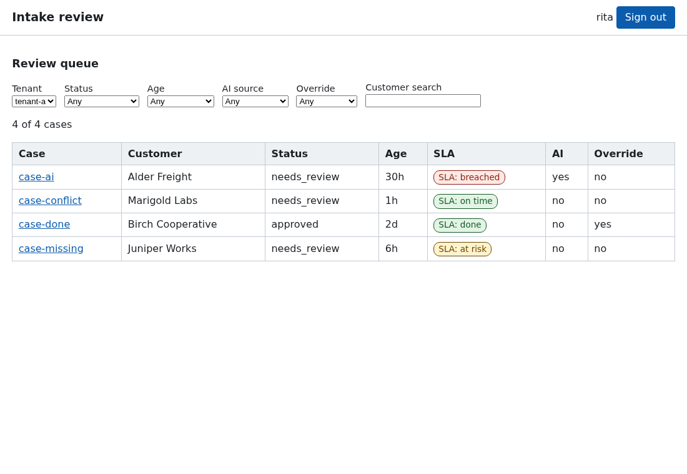
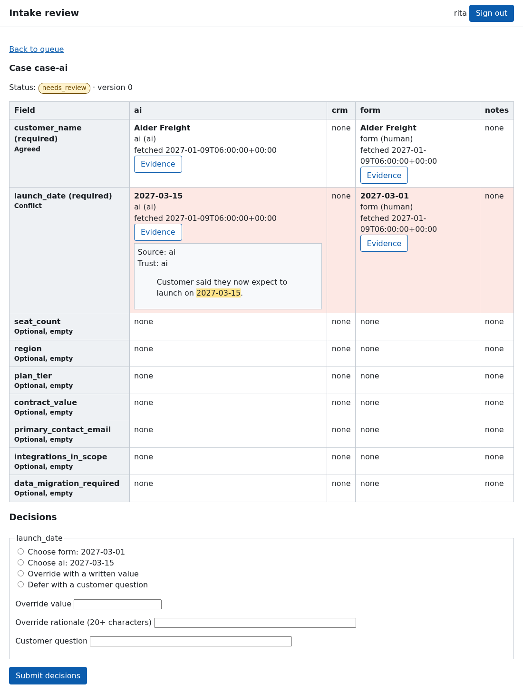

# Implementation Intake Translator

Turn conflicting kickoff facts into a reviewable, replay-safe handoff.

[](https://github.com/prashobnair/implementation-intake-translator/actions/workflows/python.yml) [](https://github.com/prashobnair/implementation-intake-translator/actions/runs/36302932422)   

## v0.4.0

Review workflow v2 adds tenant roles, versioned decisions, amendments and an
audit log, with a browser review UI tested by Playwright and axe-core. Stored
account names cannot contain a colon; the local CLI actor is never an account.
See [release notes](CHANGELOG.md#040---2026-10-07) and the review UI screenshots below.

## The problem

A fictional customer, Marigold Labs, has a signed form, a CRM deal and kickoff
notes that disagree about its launch date. Someone must compare the evidence
before a project starts, without silently choosing a value or losing the
original records. This prototype makes that decision visible and keeps a
repeat delivery from creating a second local mock project.

## What it does

- Parses versioned JSON from form, CRM and notes-shaped synthetic inputs.
- Preserves each candidate and asks for review on disagreement or missing facts.
- Displays an agreed value using `first_source_priority` (form, CRM, notes);
  equality is case-insensitive, but display keeps the first source's spelling.
- Deduplicates by event ID and rejects reuse with changed content.
- Holds a local mock projection until a reviewer picks a source for each conflict.
- Provides a disposable demo and static read-only dashboard.
- Review API v2 and a browser review UI (queue and case pages at `/ui/`): accounts and roles per tenant, versioned
  decisions with a 409 on stale versions, amendments with a diff and a hash-chained
  audit log. See [API contracts](docs/API_CONTRACTS.md).
- Accepts authenticated tenant webhooks. Three modes: HMAC-signed body with a
  five-minute window and key rotation, shared token header (Zoho custom
  header), and per-tenant API key. Bad credentials get a flat 401. Raw bodies
  are stored encrypted and erased after 30 days.

## Quickstart (offline)

Python 3.11+ and [uv](https://docs.astral.sh/uv/) are required. No vendor trial
account or key is needed.

```sh
uv sync --python 3.11
uv run --python 3.11 python -m intake_translator.demo
uv run --python 3.11 python -m intake_translator.dashboard
```

The dashboard command prints a local `file://` URL. Open that file to view the
sample outcomes. For negative inputs and expected outputs see
[the sample gallery](docs/SAMPLE_GALLERY.md); for manual review steps see
[the walkthrough](docs/DEMO.md).

## Live mode (read-only)

Not available in version 0.3.0. The illustrative CRM source is a JSON fixture,
not a Zoho connection. A future adapter will require separate setup and verified
read-only API contracts. Do not connect a work or customer account to this demo.

## How it works



The CLI and loopback-only HTTP adapter call the same core. The ledger records a
canonical payload digest, so an identical delivery replays the stored packet.
Review and local mock projection are separate operations.

## Engineering decisions

| Decision | Why | Trade-off |
|---|---|---|
| Keep the pure core on the standard library | Easy offline install and audit | No production service yet |
| Preserve candidate provenance | A reviewer sees each source | Conflicts require manual work |
| Store raw-value digest | Detect changed event ID reuse | Whitespace-only changes are treated as changed |
| Bind HTTP to loopback | Keep this a local demo | No remote intake |

See [the architecture](docs/ARCHITECTURE.md),
[offline-first ADR](docs/adr/0001-offline-first.md) and
[threat model](docs/THREAT_MODEL.md).

## Scope & safety

> Synthetic data only. No Zoho access, external writes, customer messages or
> automatic approval. The only downstream write is to a disposable local SQLite
> mock after explicit review. The HTTP adapter has no authentication, so do not
> expose or tunnel it. There is no production deployment claim.

## Review UI

The review API serves a small browser UI at `/ui/` (plain HTML and JavaScript, no build step, no CDN). Sign in, filter the queue, then decide each conflicting or missing field.





- Queue: filters for status, tenant, age, AI source and override, a customer search, and SLA badges (under 4 hours on time, 4 to 24 at risk, over 24 breached). Badges carry text, never color alone.
- Case: a field by source matrix. Conflicts and missing required fields are labeled in text as well as shaded. Each cell shows the value, source, trust and fetched time, with an Evidence button that opens the quoted passage when a source has one.
- Decisions: choose a source, override with a written rationale of 20 or more characters, or defer with a customer question. A stale version shows a clear message instead of overwriting.

Try it with synthetic data (needs `pip install -e ".[dev,e2e]"`):

```bash
python - <<'PY'
import tempfile, pathlib, uvicorn
from tests.e2e.seed import build
from intake_translator.review_layer.api import create_review_app
engine, contracts = build(pathlib.Path(tempfile.mkdtemp()) / "demo.sqlite3")
uvicorn.run(create_review_app(engine, contracts, secure_cookies=False), port=8000)
PY
```

Open http://127.0.0.1:8000/ui/ and sign in as `rita` with password `correct horse battery`. Browser tests run with `playwright install chromium` then `RUN_E2E=1 pytest tests/e2e`; they include an axe-core check for each page and regenerate the screenshots above.

## Roadmap, contributing and license

Tenant-scoped event IDs and a separately configured authenticated ingress are included; authenticated human review remains future work.
See [CONTRIBUTING.md](CONTRIBUTING.md), [SECURITY.md](SECURITY.md),
[CHANGELOG.md](CHANGELOG.md) and the [MIT license](LICENSE).

## v0.3 architecture migration (in progress)

The new `intake_translator.web.app.create_app(db_path)` offers a FastAPI adapter for the same local synthetic v1 intake packet. It does not enable a public webhook. The stdlib loopback server remains available as `intake_translator.http_api_legacy`; `intake_translator.http_api` is a compatibility alias. Do not expose either unauthenticated demo endpoint to another network.

For a copy of an existing v0.2 local SQLite database, run `DATABASE_URL=sqlite:////absolute/path/to/copy.sqlite3 uv run alembic upgrade head`. Migration `0001` leaves the original ledger and review rows intact; verify the copy before updating an original. The tenant-scoped SQLAlchemy tables are separate, and authenticated tenant ingress remains planned. See [ADR-0002](docs/adr/0002-layered-storage.md).

## Tenant field contracts (v0.3 work in progress)

A local tenant contract describes typed fields, source display order and trust. See [the v1-compatible default](config/default-contract.yaml) and [the synthetic Marigold v2 example](config/marigold-contract.yaml). `field_service.process_contract_event` keeps version 1 packet logic intact; version 2 uses the tenant's YAML contract. The default digest remains raw (whitespace changes conflict), while `normalized` replays equivalent normalized candidates. Automatic approval is off by default and records a versioned `system:unanimous-policy` review only when required fields agree and no AI source participates. Neither route triggers a live CRM action. A separate `ingress.api.create_ingress_app` accepts authenticated synthetic webhook POSTs when a tenant contract, per-source HMAC/shared token or tenant API key, and a Fernet key are provisioned. It is not a turnkey public deployment: TLS, secret delivery, proxy limits, a distributed rate limiter, scheduled retention purge and authenticated reviewer UI still need deployment work. For local tests, run `uv run pytest -q tests/test_security_exact.py`. Do not put real tokens or customer data in fixtures. Zoho CRM's documented POST supports a custom static-token header, not URL parameters; see [API contracts](docs/API_CONTRACTS.md) and [ADR-0003](docs/adr/0003-zoho-webhook-auth.md).
