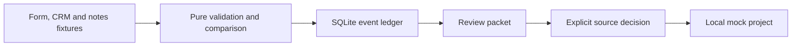

# Implementation Intake Translator

Turn conflicting kickoff facts into a reviewable, replay-safe handoff.

[](https://github.com/prashobnair/implementation-intake-translator/actions/workflows/python.yml)   

## The problem

A fictional customer, Marigold Labs, has a signed form, a CRM deal and kickoff
notes that disagree about its launch date. Someone must compare the evidence
before a project starts, without silently choosing a value or losing the
original records. This prototype makes that decision visible and keeps a
repeat delivery from creating a second local mock project.

## What it does

- Parses versioned JSON from form, CRM and notes-shaped synthetic inputs.
- Preserves each candidate and asks for review on disagreement or missing facts.
- Displays an agreed value using `first_source_priority` (form, CRM, notes);
  equality is case-insensitive, but display keeps the first source's spelling.
- Deduplicates by event ID and rejects reuse with changed content.
- Holds a local mock projection until a reviewer picks a source for each conflict.
- Provides a disposable demo and static read-only dashboard.

## Quickstart (offline)

Python 3.11+ and [uv](https://docs.astral.sh/uv/) are required. No vendor trial
account or key is needed.

```sh
uv sync --python 3.11
uv run --python 3.11 python -m intake_translator.demo
uv run --python 3.11 python -m intake_translator.dashboard
```

The dashboard command prints a local `file://` URL. Open that file to view the
sample outcomes. For negative inputs and expected outputs see
[the sample gallery](docs/SAMPLE_GALLERY.md); for manual review steps see
[the walkthrough](docs/DEMO.md).

## Live mode (read-only)

Not available in version 0.2.1. The illustrative CRM source is a JSON fixture,
not a Zoho connection. A future adapter will require separate setup and verified
read-only API contracts. Do not connect a work or customer account to this demo.

## How it works



The CLI and loopback-only HTTP adapter call the same core. The ledger records a
canonical payload digest, so an identical delivery replays the stored packet.
Review and local mock projection are separate operations.

## Engineering decisions

| Decision | Why | Trade-off |
|---|---|---|
| Keep the pure core on the standard library | Easy offline install and audit | No production service yet |
| Preserve candidate provenance | A reviewer sees each source | Conflicts require manual work |
| Store raw-value digest | Detect changed event ID reuse | Whitespace-only changes are treated as changed |
| Bind HTTP to loopback | Keep this a local demo | No remote intake |

See [the architecture](docs/ARCHITECTURE.md),
[offline-first ADR](docs/adr/0001-offline-first.md) and
[threat model](docs/THREAT_MODEL.md).

## Scope & safety

> Synthetic data only. No Zoho access, external writes, customer messages or
> automatic approval. The only downstream write is to a disposable local SQLite
> mock after explicit review. The HTTP adapter has no authentication, so do not
> expose or tunnel it. There is no production deployment claim.

## Roadmap, contributing and license

Tenant-scoped event IDs, signed webhooks and authenticated review are future work.
See [CONTRIBUTING.md](CONTRIBUTING.md), [SECURITY.md](SECURITY.md),
[CHANGELOG.md](CHANGELOG.md) and the [MIT license](LICENSE).
